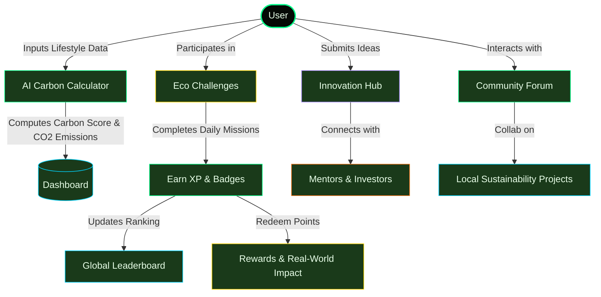

# 🌍 EcoVerse — Track. Reduce. Compete. Save Earth.

[](https://ecoverse-766402778326.us-central1.run.app)
[](https://nextjs.org/)
[](https://tailwindcss.com/)
[](https://www.typescriptlang.org/)

**EcoVerse** is the world's most engaging sustainability challenge platform. It empowers individuals to track their carbon footprint with AI, participate in gamified challenges, compete on global leaderboards, earn rewards, and submit climate-tech startup ideas to mentors and investors.

---

## 🗺️ System Flow & User Journey

Here is how the EcoVerse ecosystem connects users, data, gamification, and real-world impact:



---

## ⚡ Key Features

*   **🤖 AI Carbon Calculator**: Real-time lifestyle profiling (transportation, electricity, water, diet, shopping, digital) to compute carbon scores and provide personalized reduction strategies.
*   **🏆 Gamified Challenges**: Join daily and weekly eco-missions, maintain streaks, earn XP, and unlock achievements.
*   **🌍 Global Tournaments**: Compare impact with eco-warriors globally. Includes regional leaderboards and group-based competitions.
*   **💡 Innovation Hub**: A startup launchpad for climate-tech. Pitch sustainable ideas directly to mentors and green venture capitalists.
*   **🌱 Real-World Impact**: Redeem earned XP points for real-world environmental sponsorships (e.g., planting trees, clean water initiatives).
*   **💬 Active Community**: A collaborative space to exchange ideas, join local clean-ups, and form regional sustainability groups.

---

## 🛠️ Technology Stack

*   **Framework**: Next.js 15 (App Router, Standalone Mode enabled)
*   **Language**: TypeScript
*   **Styling**: Tailwind CSS & Vanilla CSS
*   **Animations**: Framer Motion (for smooth interactive transitions)
*   **Charts & Visuals**: Recharts (interactive responsive dashboard graphs)
*   **Icons**: Lucide React

---

## 🚀 Getting Started

### Local Development

1.  **Clone the repository**:
    ```bash
    git clone https://github.com/thenikhilbisht/EcoVerse.git
    cd EcoVerse
    ```

2.  **Install dependencies**:
    ```bash
    npm install
    ```

3.  **Run the development server**:
    ```bash
    npm run dev
    ```
    Open [http://localhost:3000](http://localhost:3000) to view it in the browser.

### Building for Production

To create an optimized production bundle:
```bash
npm run build
npm run start
```

---

## 📦 GCP Cloud Run Deployment

This project is optimized for deployment to **Google Cloud Run** using Next.js Standalone build.

### Deployment Prerequisites

Ensure you have the Google Cloud SDK installed and are logged in:
```bash
gcloud auth login
gcloud config set project challenge-3-499306
```

### Deploying the App

Run the following command to build the Docker image via Google Cloud Build and deploy to Cloud Run:
```bash
gcloud run deploy ecoverse --source . --project challenge-3-499306 --region us-central1 --allow-unauthenticated
```
The command automatically respects the [.gcloudignore](file:///.gcloudignore) and builds the application inside an optimized Docker environment using the root [Dockerfile](file:///Dockerfile).
